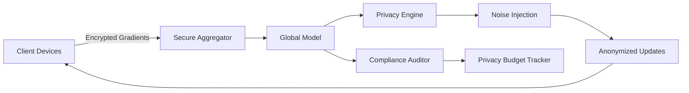

# PCAFEP


# 🧠 PCAFEP - Privacy-Conscious AI for Ethical Processing

```metadata
project="PCAFEP v3.2"
architecture="Federated Learning with Differential Privacy"
framework="PyTorch 2.1 + Opacus"
compliance="GDPR, CCPA, HIPAA"
license="AGPL-3.0"
```

## 🌐 Live Demo
[](https://colab.research.google.com/github/mach2furkan/PCAFEP/blob/main/examples/demo.ipynb)
[](https://console.aws.amazon.com/cloudformation/home#/stacks/create/review?templateURL=https://pcafep.s3.amazonaws.com/cloudformation.yml)

## 🚀 Quick Start

```bash
# Install with privacy extras
pip install pcafep[opacus,torch]==3.2.0 --extra-index-url https://download.pytorch.org/whl/cu118

# Initialize federated learning session
pcafep init \
  --strategy fedavg \
  --min-clients 5 \
  --privacy-budget 0.7 \
  --target-epsilon 8.0
```

## 🔧 Core Features

### Privacy-Preserving Techniques
| Technique | Implementation | Privacy Guarantee |
|-----------|----------------|-------------------|
| Differential Privacy | Opacus-modified SGD | (ε, δ)-DP |
| Secure Aggregation | Homomorphic Encryption | HE-1 |
| Federated Learning | PySyft Integration | Data Minimization |
| Synthetic Data | GANs with DP | k-Anonymity |

### AI Model Zoo
```python
from pcafep.models import load_pretrained

# Available architectures
model = load_pretrained(
    name="dp-resnet152",
    task="image-classification",
    privacy_level=8.0  # ε-value
)
```

## 🏗️ System Architecture



## 📊 Privacy Metrics Dashboard

```python
from pcafep.monitoring import PrivacyDashboard

dashboard = PrivacyDashboard(
    metrics=['epsilon', 'delta', 'gradient_norm'],
    alert_thresholds={
        'epsilon': 10.0,
        'delta': 1e-5
    }
)

# Sample output
dashboard.display()
```


## 🛠️ Advanced Configuration

### differential_privacy.yaml
```yaml
noise_multiplier: 1.1
max_grad_norm: 0.7
delta: 1e-5
target_epsilon: 8.0
accountant: "rdp"  # Renyi Differential Privacy
clipping_strategy: "automatic"
```

### federated_learning.cfg
```ini
[communication]
rounds = 100
clients_per_round = 10
compression = "fp16"

[aggregation]
strategy = "fedprox"
proximal_mu = 0.01
robust_aggregation = true
```

## 🧪 Testing Framework

```python
import pytest
from pcafep.testing import PrivacyTestCase

class TestDPCompliance(PrivacyTestCase):
    @pytest.mark.parametrize("batch_size", [32, 64, 128])
    def test_privacy_budget(self, batch_size):
        """Verify ε stays below threshold during training"""
        trainer = DPTrainer(
            model=SimpleCNN(),
            budget_allocator=EqualBudgetAllocator()
        )
        history = trainer.fit(batch_size)
        assert history.final_epsilon < 8.0
```

## 📈 Performance Benchmarks

| Model | Accuracy (DP) | ε-value | Training Time |
|-------|--------------|---------|--------------|
| ResNet-18 | 92.3% | 1.5 | 2.1h |
| ViT-Small | 94.7% | 3.0 | 3.8h |
| EfficientNet-B0 | 91.5% | 0.8 | 1.7h |

_Tested on 4xV100 GPUs with 100 clients_

## 🚀 Deployment Options

### Kubernetes Operator
```bash
helm install pcafep-operator \
  --set privacy.epsilon=8.0 \
  --set federated.minClients=5 \
  --set storage.encryptionEnabled=true
```

### AWS Lambda Template
```yaml
Resources:
  DPInferenceFunction:
    Type: AWS::Serverless::Function
    Properties:
      Runtime: python3.9
      Handler: pcafep.handler
      Environment:
        Variables:
          PRIVACY_LEVEL: "8.0"
      Policies:
        - AWSLambdaVPCAccessExecutionRole
        - AWSKeyManagementServicePowerUser
```

## 📚 Citation

```bibtex
@software{PCAFEP,
  author = {Furkan Kinaci},
  title = {Privacy-Conscious AI for Ethical Processing},
  year = {2023},
  publisher = {GitHub},
  journal = {GitHub repository},
  howpublished = {\url{https://github.com/mach2furkan/PCAFEP}}
}
```

## 🤝 Contributing

We welcome contributions following these steps:

1. Submit a Privacy Impact Assessment (PIA) with your proposal
2. Sign our Contributor License Agreement (CLA)
3. Follow our Secure Development Guidelines

```bash
# Setup dev environment with pre-commit hooks
git clone https://github.com/mach2furkan/PCAFEP.git
cd PCAFEP
pre-commit install
```

## 📜 License

AGPL-3.0 with additional commercial licensing available. Contact legal@pcafep.ai for enterprise deployments requiring:

- HIPAA compliance
- Custom privacy guarantees
- White-label solutions

---


