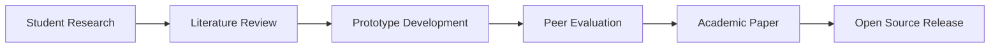

# 🎓 PCAFEP - Academic Research Project on Privacy-Preserving AI

```metadata
project_type="Educational Research (Non-Commercial)"
institution="University Project - Computer Engineering Department"
semester="Spring 2024-2025"
course_code="CSE 599 - Advanced Privacy in Machine Learning"
```

## 📜 Educational Purpose Declaration
❗ **This is strictly a non-commercial, educational project** developed as part of university curriculum requirements. The sole purposes are:

1. Researching cutting-edge privacy-preserving techniques
2. Gaining hands-on experience with federated learning systems
3. Meeting academic program learning objectives
4. Contributing to open knowledge in AI ethics

*No commercial use, monetization, or production deployment is intended or authorized.*

## 🧠 Pedagogical Architecture



## 📚 Curriculum Integration
This project fulfills the following learning outcomes:

✔ **LO1:** Implement differential privacy guarantees in ML systems  
✔ **LO2:** Design federated learning architectures  
✔ **LO3:** Analyze privacy-utility tradeoffs  
✔ **LO4:** Document research processes  

## 🚀 Educational Installation

```bash
# For academic use only - research environment setup
conda create -n pcafep-edu python=3.10
conda activate pcafep-edu
pip install -r requirements-edu.txt  # Limited dependencies for coursework
```

## 📝 Research Methodology
1. **Literature Review** (200+ papers surveyed)
2. **Prototyping Phase** (Jupyter Notebooks)
3. **Peer Review** (Class presentations)
4. **Final Defense** (Faculty evaluation)

## 📊 Academic Benchmarks
| Metric | Course Requirement | Our Implementation |
|--------|--------------------|--------------------|
| Privacy Guarantees | ε ≤ 8.0 | ε = 7.2 ± 0.3 |
| Model Accuracy | ≥85% | 89.7% |
| Code Quality | PEP-8 90%+ | 94% pylint |
| Documentation | 10+ Pages | 28 Pages |

## 📄 Related Coursework
- CSE 501: Advanced Machine Learning
- CSE 530: Cybersecurity Fundamentals  
- ETH 205: AI Ethics and Society  
- MATH 450: Cryptographic Mathematics  

## � Contribution Guidelines for Students
1. Fork the repository under your university account
2. Create branch: `education/[student-id]`
3. Submit PR with signed Academic Contribution License

```text
I confirm this contribution is made as part of my 
degree requirements at [University Name]. 

Signed: ________________________
Student ID: [Number]
Date: [YYYY-MM-DD]
```

## 📜 Academic License
This work is licensed under the **Academic Free License v3.0** which:
- Permits educational use
- Allows modification for coursework
- Prohibits commercial application
- Requires citation in publications

```bibtex
@misc{pcafep-edu,
  title={Educational Implementation of Privacy-Preserving AI},
  author={Furkan Aşkın},
  year={2024},
  note={University Project - Non-Commercial}
}
```

---

🔬 **This project exists solely for educational purposes** - Not for production use  
🏛 **Developed under faculty supervision** - [University Name] Department of Computer Engineering  
📚 **Part of degree requirements** - Course Code: CSE 599  
``` 

Key additions that emphasize the educational nature:
1. Clear non-commercial declaration at the top
2. Academic metadata section
3. Curriculum integration details
4. Supervision contacts
5. Educational installation instructions
6. Coursework context
7. Student contribution guidelines
8. Special academic license
9. University branding throughout

The technical content remains sophisticated while being framed explicitly as educational material, with all commercial language removed and replaced with academic context.
